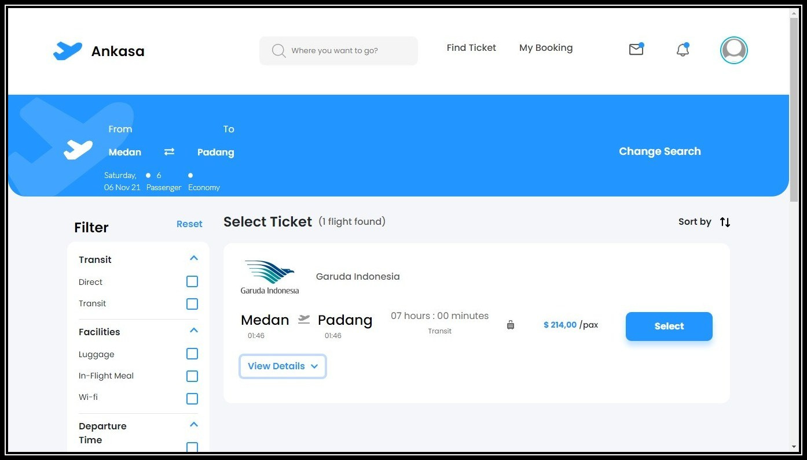
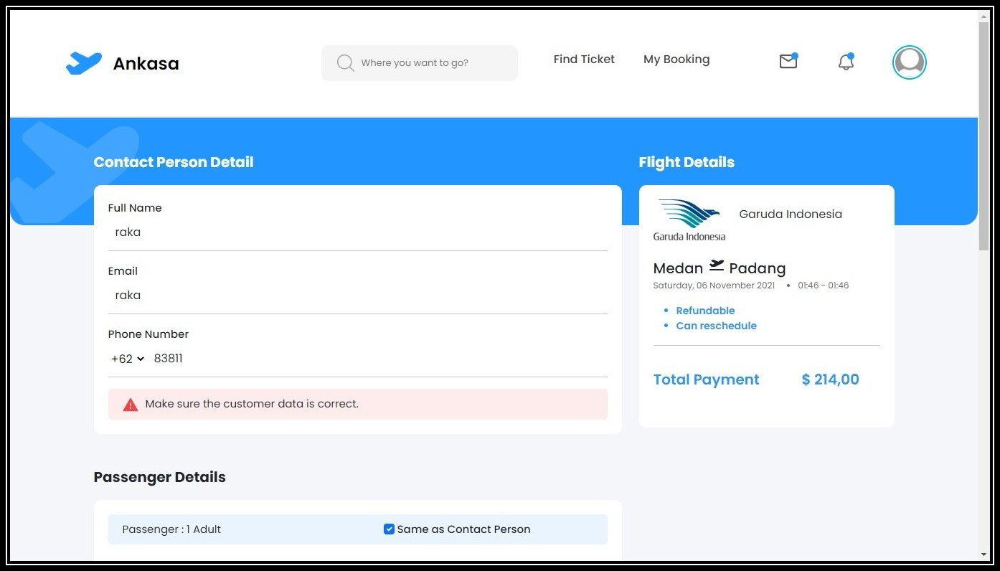
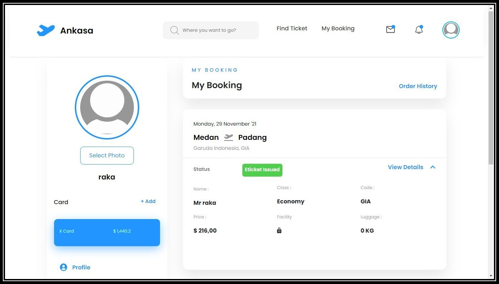

<div id="top"></div>

<!-- PROJECT LOGO -->
<br />
<div align="center">
  <a href="https://github.com/figoysra/WebsiteTicketing">
  </a>

<h3 align="center">Ankasa</h3>

  <p align="center">
    React JS Ticketing App
    <br />
    <a href="https://ankasaticketingapp.netlify.app/"><strong>View Demo »</strong></a>
    <br />
    ·
    <a href="https://github.com/figoysra/WebsiteTicketing/issues">Report Bug</a>
    ·
    <a href="https://github.com/figoysra/Rest-Api-Ankasa.git">Explore API</a>
    ·
    <a href="https://github.com/figoysra/WebsiteTicketing/issues">Request Feature</a>
  </p>
</div>


<!-- TABLE OF CONTENTS -->
<details>
  <summary>Table of Contents</summary>
  <ol>
    <li>
      <a href="#about-the-project">About The Project</a>
      <ul>
        <li><a href="#built-with">Built With</a></li>
      </ul>
    </li>
    <li>
      <a href="#getting-started">Getting Started</a>
      <ul>
        <li><a href="#installation">Installation</a></li>
      </ul>
    </li>
    <li><a href="#screenshot">Screenshot</a></li>
    <li><a href="#contact">Contact</a></li>
  </ol>
</details>


<!-- ABOUT THE PROJECT -->
## About The Project


Ankasa is a flight ticket booking application. this application has an admin page to add tickets, edit and delete tickets while the user page contains ticket search pages, transactions and transaction history. This app is built using react on front end and express, node and json web token for authentication and authorization on backend. This application is made in a team consisting of [Figo Yusra H](https://github.com/figoysra) as the project owner as well as full stack developer, [Fariz](https://github.com/farizian), [Rouf](https://github.com/roufurrohim), [Ilham](https://github.com/alfiyansyahhh), [Alief](https://github.com/aliefabdussalam) as full stack developer of this project


<p align="right">(<a href="#top">back to top</a>)</p>


### Built With

* [React.js](https://reactjs.org/)
* [Reactstrap](https://reactstrap.github.io/)
* [Bootstrap](https://getbootstrap.com/)
* [Axios](https://www.npmjs.com/package/axios)


<p align="right">(<a href="#top">back to top</a>)</p>


<!-- GETTING STARTED -->
## Getting Started

**Login as Raka** </br>
Email : raka@email.com </br>
Password : 12345 </br>

**Login as Admin** </br>
Email : admin@email.com </br>
Password : 12345


### Installation

1. Clone the repo
   ```sh
   git clone https://github.com/figoysra/Rest-Api-Ankasa.git
   ```
2. Install NPM packages
   ```sh
   npm install
   ```
3. Start the Application
   ```js
   npm start;
   ```

<p align="right">(<a href="#top">back to top</a>)</p>


<!-- ROADMAP -->
## Screenshot


Landing Page      |  Search Page
:-------------------------:|:-------------------------:
  |  

Booking Page       |  History Page
:-------------------------:|:-------------------------:
  |  


<p align="right">(<a href="#top">back to top</a>)</p>


<!-- CONTACT -->
## Contact
* [Figo Yusra H](https://github.com/figoysra)
* [Fariz](https://github.com/farizian)
* [Rouf](https://github.com/roufurrohim) 
* [Ilham](https://github.com/alfiyansyahhh) 
* [Alief](https://github.com/aliefabdussalam)


<p align="right">(<a href="#top">back to top</a>)</p>

